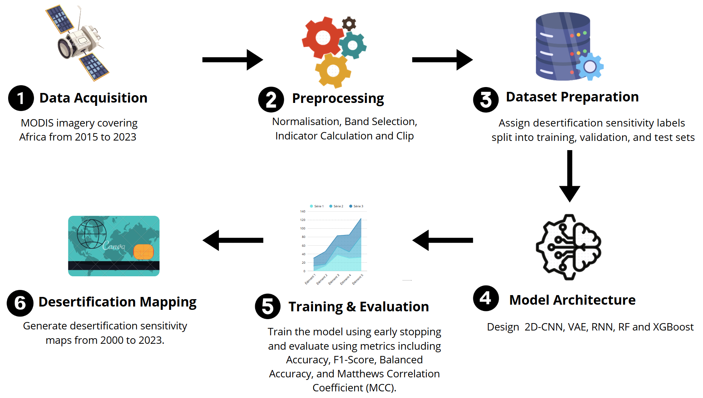
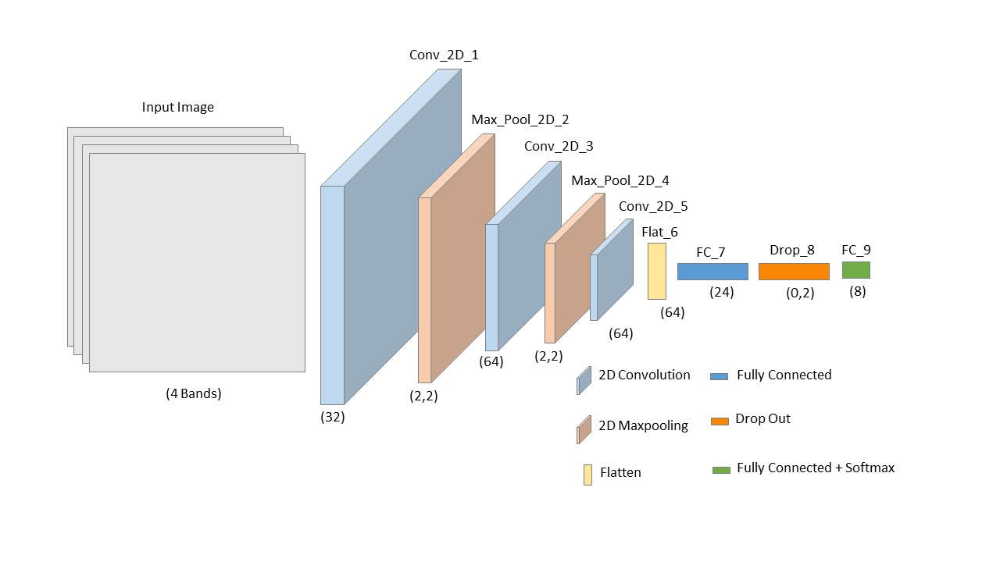

# 2D-CNN: Two-Dimensional Convolutional Neural Network for Monitoring Desertification in Africa Using Remote Sensing Images
This is a Python implementation of the paper: An End-to-End Pipeline Based on a Two-Dimensional Convolutional Neural Network for Monitoring Desertification in Africa Using Remote Sensing Images.

The aim of this project is to develop an end-to-end deep learning pipeline for monitoring desertification in Africa using multi-temporal remote sensing data. By integrating a Two-Dimensional Convolutional Neural Network (2D-CNN) with spatiotemporal analysis, the project seeks to:
. Enhance the accuracy and efficiency of desertification detection compared to traditional machine learning models.
. Analyze long-term desertification trends (2000–2023) to identify vulnerable regions requiring urgent intervention.
. Provide a scalable AI-driven framework for environmental monitoring and disaster resilience, supporting data-driven decision-making for land management policies.

This research contributes to the advancement of remote sensing-based AI applications for sustainable environmental management in arid and semi-arid regions.
The proposed end-to-end pipeline for desertification monitoring integrates a Two-Dimensional Convolutional Neural Network (2D-CNN) with remote sensing data to enhance accuracy in large-scale environmental analysis. The pipeline consists of six key phases. First, data collection involves retrieving multi-temporal MODIS satellite imagery and key remote sensing indices such as NDVI, MSAVI, Albedo, and TGSI using Google Earth Engine. The preprocessing phase includes normalizing and transforming the raw satellite data and computing essential environmental indices to improve the accuracy of desertification assessment. Next, the sampling phase constructs a labeled dataset by extracting features from environmentally sensitive areas, ensuring balanced and representative data. The model development phase focuses on training and fine-tuning a 2D-CNN model for automated feature extraction and classification of desertification sensitivity levels. The trained model undergoes rigorous evaluation using metrics such as accuracy, precision, recall, and F1-score, comparing its performance with traditional machine learning models like Random Forest, XGBoost, RNN, and Variational Autoencoders (VAE). Finally, the prediction and mapping phase applies the optimized model to generate spatiotemporal maps of desertification risk across Africa from 2000 to 2023. 

The Two-Dimensional Convolutional Neural Network (2D-CNN) architecture used in this study is designed for effective spatial feature extraction and classification of desertification sensitivity using remote sensing data. The model processes multi-band satellite imagery, where each input image consists of four key remote sensing indices: NDVI, MSAVI, Albedo, and TGSI. The architecture begins with a convolutional layer that applies 32 filters to extract low-level spatial patterns, followed by a max-pooling layer that reduces spatial dimensions while retaining important features. This process is repeated with a second convolutional layer containing 64 filters, further refining feature extraction. Another max-pooling layer follows to enhance computational efficiency. A final convolutional layer with 64 filters captures deeper spatial relationships in the data. The extracted features are then flattened into a one-dimensional vector and passed through a fully connected layer with 24 neurons, allowing the model to learn complex, high-level representations of desertification patterns. To prevent overfitting, a dropout layer with a 0.2 dropout rate is incorporated before the final Softmax classification layer, which outputs probabilities for the eight desertification sensitivity classes. The 2D-CNN model leverages hierarchical feature learning to enhance classification accuracy, outperforming traditional machine learning approaches in detecting and mapping desertification trends across Africa.

## Hardware and Software Requirements
This code was tested on a system with the following specifications:
- OS: Win11
- Memory (RAM): 8GB
- Disk storage: 1TB
- CPU: Intel(R) Core(TM) i5-8400 CPU @ 2.80GHz 2.81 GHz

The model is implemented using Python3 with dependencies:
- TensorFlow 2.6.2
- Keras 2.6.0
- numpy 1.19.5 
- pandas 1.1.5
- scipy 1.5.4 
- scikit\_learn 0.24.2
- matplotlib 3.3.4  
## Dataset
The MSAVI, NDVI, TGSI and Albedo data used in this study are downloaded from the Google Earth Engine cloud computing platform (https://earthengine.google.com)
